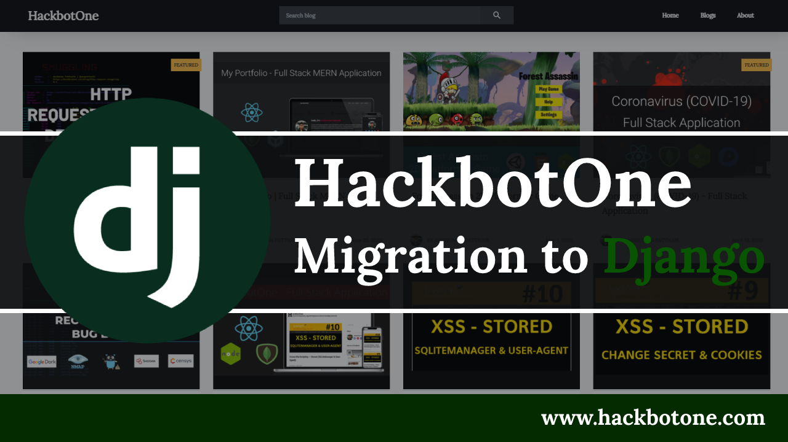

## Technical Overview
To make the platform more stable & secure I have migrated the HackbotOne website to Django, it's because in the old website there are many kinds of missing items that I had found so to make the site more efficient I have to rebuild the site using Django. And also due to Django built-in security protection, it's quite easier to maintain the site more securely.

### Production URL
https://hackbotone.com

## HackbotOne API
Before cloning this repository make sure you've cloned the [hackbotone-api](https://github.com/anshumanpattnaik/hackbotone-api) project and completed all the setup in your local machine and the project should be running as per the instruction.

### Installation
````````````````````````````````````````````````````````````````
git clone https://github.com/anshumanpattnaik/hackbotone-website.git
cd hackbotone-website
python3 -m venv env
source env/bin/activate
pip3 install -r requirements.txt
python3 manage.py runserver 8003
````````````````````````````````````````````````````````````````

Open http://127.0.0.1:8003 on your browser

### Note
If you are facing any issues or problems then feel free to raise an issue.

### Youtube Explantation
1. https://youtu.be/TRaejKHVhj8

### License
This project is licensed under the [MIT License](LICENSE)
